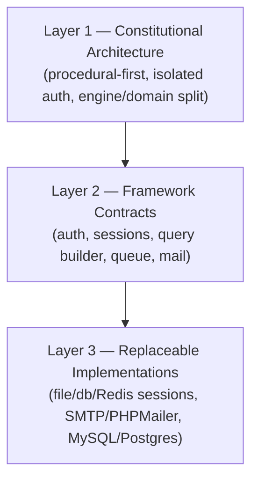
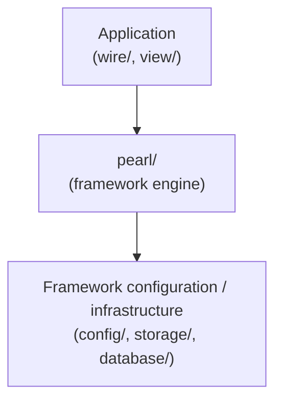
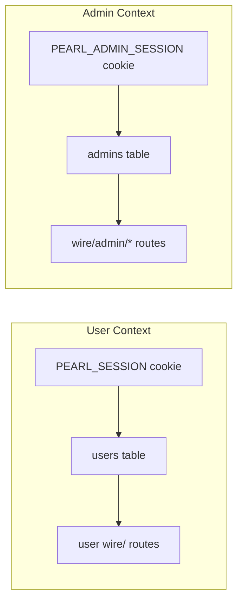
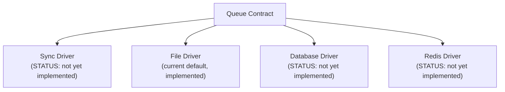
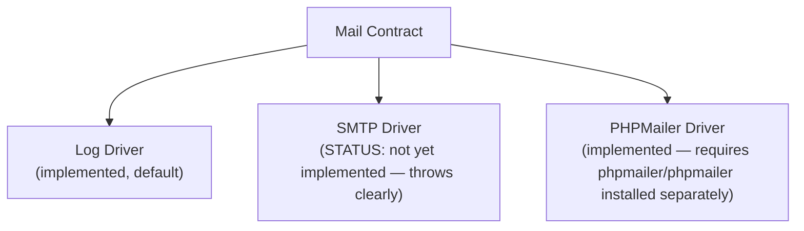
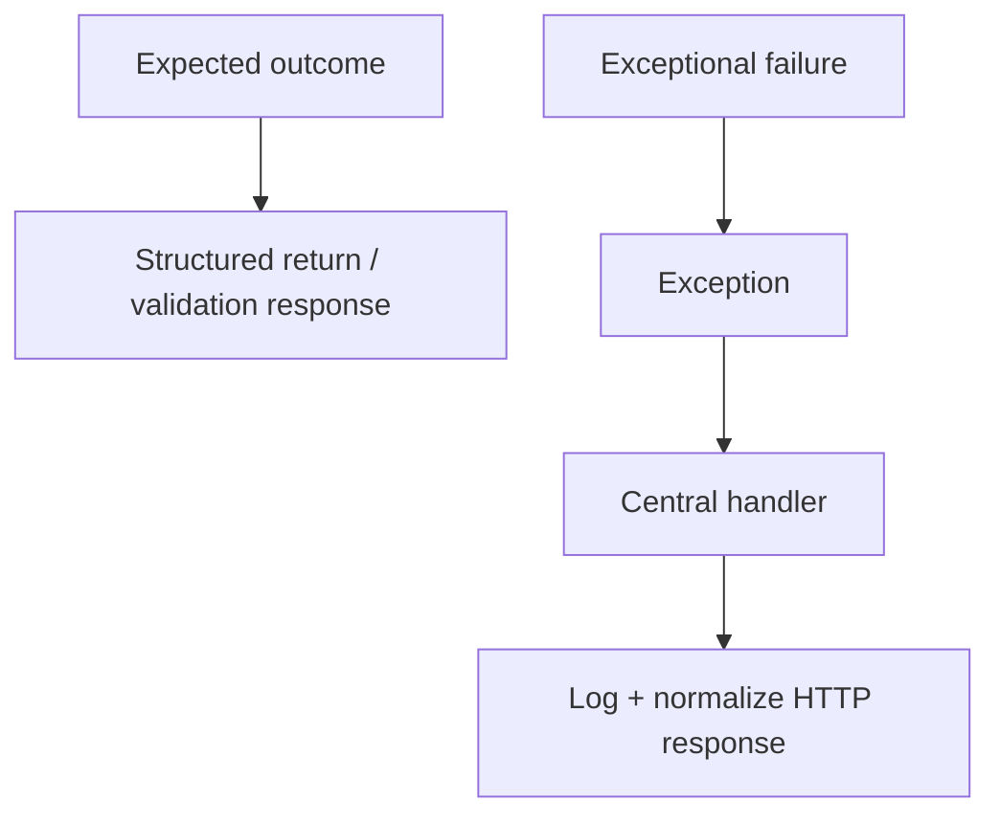

# PEARL — Architecture

**Status:** Living document — source of truth for Pearl's architecture, principles, and open questions.
**Audience:** Pearl contributors, present and future.

---

## 1. Project Identity

| | |
|---|---|
| **Project** | PEARL |
| **Description** | A lightweight, secure, procedural PHP framework with file-based routing, designed to let developers build applications quickly without unnecessary framework ceremony or OOP abstraction. |
| **Origin** | Built from scratch — not a modification or fork of an existing legacy framework (not a continuation of the earlier FluxPHP codebase). |
| **Target package** | `pearl/framework` (Packagist, not yet published) |
| **License** | MIT |
| **Copyright holder** | Pearl Framework Contributors |
| **Owning organization** | Bluxtechnologies |
| **PHP version** | `STATUS: PROVISIONAL — REQUIRES VERIFICATION`. Everything built so far (`composer.json`, every runtime check) targets **PHP 8.3+**. This document was commissioned specifying **PHP 8.4+**. These conflict and must be reconciled explicitly — not silently resolved in either direction. |
| **Development environment** | XAMPP / local development initially, with eventual support for standard PHP hosting, VPS, and cloud environments. |

---

## 2. Core Philosophy

### 2.1 Procedural-first

Pearl defaults to procedural PHP because:

- functions are straightforward to read;
- control flow is explicit, not routed through containers or indirection;
- debugging means reading top-to-bottom, not tracing through layers of abstraction;
- onboarding a new contributor is faster;
- there is less boilerplate than a class-per-concept architecture demands;
- no dependency injection container is required;
- no inheritance hierarchy is required;
- framework behavior remains traceable — a developer can `grep` for a function and find its one definition.

### 2.2 The deliberate OOP exception

The query builder (`PearlQuery`, accessed only through the `query()` entry function) is Pearl's one intentional class. Fluent chaining —

```php
query('users')
    ->where('status', '=', 'active')
    ->order('created_at', 'desc')
    ->limit(10)
    ->get();
```

— benefits naturally from an object returning `$this` on each call. There is no procedural equivalent that reads as cleanly. This is a **contained, deliberate exception**, not a precedent. It does not imply that other parts of Pearl should gradually adopt classes, controllers, services, or repositories. Any future proposal to introduce a class elsewhere in `pearl/` must justify itself on the same narrow grounds (chaining that procedural code cannot express as cleanly) — not on convention, familiarity, or "it's how other frameworks do it."

### 2.3 No hidden magic

Pearl deliberately avoids:

- automatic dependency injection;
- autowiring;
- facades;
- hidden event hooks or lifecycle callbacks a developer didn't explicitly wire up;
- unexplained global state mutation;
- reflection-heavy architecture;
- any framework behavior a developer cannot trace by reading the files involved.

### 2.4 Explicit over magical

Conventions are allowed to determine *structure* — file-based routing, the `wire/admin/*` namespace mapping to admin auth context, migration file naming. But **security-sensitive and behavior-sensitive decisions must remain explicit in code**, not inferred from convention alone. A developer should never have to wonder "is this route protected?" — the answer should be a visible `auth_require_admin()` call at the top of the file, not an assumption based on folder placement alone (folder placement determines *context*; the explicit call enforces the *guard*).

---

## 3. Architectural Invariants

These are the rules that change slowly, if ever. They are not to be revisited for implementation convenience, deadline pressure, or because an individual feature would be easier to build by breaking one of them.

1. `pearl/` contains framework engine code only.
2. Application/domain logic belongs in `wire/`.
3. Pearl must not know application-specific tables, business rules, or workflows.
4. Routing is file-based.
5. Pearl is procedural-first.
6. The query builder is the deliberate, sole OOP exception.
7. User and administrator authentication contexts remain isolated.
8. `users` and `admins` remain separate tables — never collapsed into one table with a role column.
9. Security-sensitive behavior must not rely on developer memory (it must be enforced by the framework or fail loudly, not depend on a developer remembering a step).
10. Database integrity is enforced by the database where appropriate (foreign keys, uniqueness constraints, not application-layer checks alone).
11. Framework behavior should remain explicit and traceable.
12. Framework extensions must use documented/public contracts rather than modifying engine internals.
13. A technically working implementation can still be rejected if it violates Pearl's architectural principles.
14. Application-specific code must never leak into the framework engine.
15. Architectural tradeoffs must be documented, not hidden.

---

## 4. Architecture Layers

Pearl's architecture separates into three layers with different stability guarantees. Confusing these — treating a Layer 3 implementation choice as if it were a Layer 1 invariant, or vice versa — is a common source of bad proposals.

### Layer 1 — Constitutional architecture
*Changes almost never. Changing these requires deliberate, discussed, documented architectural revision.*

- Procedural-first
- File-based routing
- Isolated dual auth contexts
- Engine/domain separation (`pearl/` vs `wire/`)
- Explicit behavior over magic
- Secure-by-default posture
- No hidden magic

### Layer 2 — Framework contracts
*Stable developer-facing interfaces. The contract is stable even when the implementation behind it is swapped.*

- Request handling
- Response handling
- Routing
- Authentication
- Sessions
- Query builder
- Transactions
- Migrations
- Queues
- Mail
- Security helpers (CSP, headers)

### Layer 3 — Replaceable implementations
*Swappable behind a Layer 2 contract. Changing these is a configuration decision, not an architectural one.*

- File / database / Redis sessions
- File / database / Redis queues
- SMTP / PHPMailer / external-provider mail
- File / database / Redis cache
- MySQL / PostgreSQL



Why this separation matters: it lets Pearl say "yes, this can change" and "no, this cannot change" without ambiguity. A pull request swapping the session driver is a Layer 3 change — low ceremony. A pull request merging `users` and `admins` is a Layer 1 change — it should not be merged regardless of how clean the code is, because it violates an invariant, not a convention.

---

## 5. Folder Architecture

```text
pearl/        — framework engine
wire/         — application/domain modules
view/         — pages, layouts, components
ink/          — frontend source (CSS, JS, email templates)
config/       — structured configuration, env-driven
public/       — web entry point, compiled assets
storage/      — runtime-generated state
database/     — migrations
```

### `pearl/` — Framework engine

Router, request/response, authentication primitives, database connection, query builder, migrations runner, queue, mail, security headers/CSP, the Vite asset helper, and other generic framework infrastructure. Nothing here may reference a specific application's tables, routes, or business rules.

### `wire/` — Application/domain modules

Fat domain modules: validation, business rules, actions, application-specific queries, domain behavior. This is where an application built *with* Pearl lives; it is never shipped as part of the framework itself.

### `view/` — Pages, layouts, components

Server-rendered PHP templates. Layouts (`view/layouts/`) wrap page content; `pearl_view()` handles rendering and injection.

### `ink/` — Frontend source

CSS and JavaScript source, built by Vite into `public/build/`. Email templates, where HTML-formatted mail is needed, also belong here conceptually (not yet implemented — mail currently sends plain text; see Open Items).

### `config/` — Configuration

Plain PHP files returning arrays, consuming environment variables via `env()`. Lazy-loaded only when needed (e.g. `config/mail.php`, `config/security.php`), not eagerly loaded on every request.

### `public/` — Web entry point

The only web-accessible directory. Contains `index.php` (the front controller), compiled Vite assets (`public/build/`), and `.htaccess`.

### `storage/` — Runtime state

Sessions, queue jobs (pending/failed), file-driver mail output, logs. Nothing here is version-controlled; all of it is regenerable.

### `database/` — Migrations

Numbered `.php` migration files, run by `php bin/pearl migrate`.

---

## 6. Dependency Direction



The invariant that matters is conceptual, not mechanical:

> **Application code may depend on Pearl. Pearl must never depend on a specific application.**

This is not a statement about PHP's `require`/`include` mechanism — Pearl's global function availability (every `pearl/*.php` file loaded into the same process) is an implementation detail of how PHP resolves function calls, not the architecture itself. The architecture is the *rule* that `pearl/` never contains a reference to a `wire/` file, a specific table name beyond its own (`users`, `admins`, `migrations`), or any business logic. The dependency direction is enforced by discipline and code review, not by a language-level boundary — procedural PHP has no package-privacy mechanism to enforce this automatically, which makes the human-enforced invariant more important, not less.

---

## 7. File-Based Routing

Pearl uses file-based routing — a request path resolves to a `wire/` file via longest-matching-segment-prefix, with remaining segments passed as `$params`.

**Why file-based routing:**

- URL structure corresponds directly to file structure;
- route discovery requires no central registration step (no routes file to keep in sync);
- a developer can locate the handler for any URL by looking at the filesystem;
- no hidden route table exists to fall out of sync with reality;
- avoids reflection/attribute-parsing overhead and indirection;
- fits procedural PHP's "read top to bottom" philosophy.

**Resolution example:**

```text
/                   -> wire/home.php            $params = []
/users              -> wire/users.php           $params = []
/users/42           -> wire/users.php           $params = ['42']
/users/42/edit      -> wire/users.php           $params = ['42', 'edit']
/admin/dashboard    -> wire/admin/dashboard.php  $params = []
```

**Documented behaviors:**

- **Route parameters** — positional, passed as `$params` array; a `wire/` module destructures what it needs (`$id = $params[0] ?? null;`).
- **HTTP method enforcement** — each `wire/` module branches on `request_method()` itself (fat-module pattern); there is no separate method-routing layer. Unhandled methods return `405`.
- **Validation** — the module's responsibility, not the router's.
- **Route guards** — explicit function calls at the top of a module (`auth_require_admin()`), never inferred from path alone.
- **404 behavior** — no matching file at any segment-prefix length renders a `404` via `pearl_render_error_page()`.
- **405 behavior** — a matched file exists but the module's own method `match()` falls through to `default => response_status(405)`.
- **`Allow` header on 405** — `STATUS: PROVISIONAL — REQUIRES VERIFICATION`. Not currently implemented; each module's `default` arm sends a bare `405` without listing which methods *are* allowed.

The critical distinction: **routing (which file handles this URL) is convention. Authorization (is this request allowed to do this) is always explicit.** The two must never be conflated — path namespace (`/admin/*`) determines *auth context* (which table/session applies), but never *by itself* grants access. Access still requires an explicit `auth_require_admin()`/`auth_check()` call in the module.

---

## 8. Authentication Architecture



Pearl uses two fully isolated authentication contexts, not one table with a role column.

**Context detection** is path-based: any request under `/admin` resolves to admin context; everything else resolves to user context. This single detection point (`session_detect_context()`) drives three downstream decisions consistently: which session cookie name is used, which database table `auth_attempt()`/`auth_user()` query against, and what `auth_is_admin()` evaluates.

**Cookie isolation**, controlled by `AUTH_MODE`:

- `dual` (default) — separate cookies (`PEARL_SESSION`, `PEARL_ADMIN_SESSION`), separate session files on disk. A browser can be authenticated as both a user and an admin simultaneously with zero data bleed between them.
- `single` — one shared cookie (`PEARL_SESSION`) for both contexts; access control then depends entirely on application-level checks rather than session isolation.

**Documented mechanics:**

- **Login** (`auth_login()`) — verifies credentials via `auth_attempt()` against the context-appropriate table, and on success regenerates the session ID before storing the authenticated ID.
- **Session regeneration** — `session_regenerate_id(true)` runs on every successful login, specifically to prevent session fixation.
- **Logout** (`auth_logout()`) — explicitly starts the session (if not already active) before destroying it. This was a real bug: an earlier version called `session_destroy_pearl()` without first ensuring a session was active, which silently no-op'd when no session had been started yet in that request.
- **Password hashing** — `password_hash()` with `PASSWORD_DEFAULT`, via the single-owner `auth_hash_password()` function.
- **Password verification** — `password_verify()`, with a constant-work fallback: when no matching row exists, `auth_attempt()` still runs `password_verify()` against a dummy hash, so a nonexistent email does not respond measurably faster than a wrong password (a basic timing-attack mitigation).
- **Password rehashing** — `STATUS: PROVISIONAL — REQUIRES VERIFICATION`. Not yet implemented. `password_needs_rehash()` is not currently called anywhere in the auth flow.
- **Authorization** — `auth_is_admin()` requires *both* admin context (path-based) *and* an authenticated session; `auth_require_admin()` is the enforcement wrapper that 403s and halts the request otherwise.
- **Ownership checks** (a user acting only on their own resources, as opposed to any authenticated user's) — `STATUS: PROVISIONAL — REQUIRES VERIFICATION`. No generic ownership-check helper exists yet; this would currently be hand-rolled per `wire/` module (e.g. `WHERE user_id = :current_user_id`).

**Why separate tables, not a role column:**

- structural isolation — a compromise of the `admins` table (e.g. a SQL injection in a user-facing feature) cannot, by table structure alone, expose admin credentials;
- different lifecycles — admin accounts are provisioned differently than user signups, and may need different lifecycle rules entirely;
- different policies — admin accounts may eventually need different password/session policies than user accounts, which is awkward to express as conditional logic on a shared table;
- potentially different fields — the two will likely diverge in schema over time (an admin's "role," a user's "subscription tier") in ways a shared table resists;
- reduced authentication-context confusion — there is no `WHERE role = 'admin'` check to forget anywhere in the codebase, because the separation is structural, not conditional.

**Precise claim about what this architecture guarantees:**

> The separate contexts prevent a normal user session from being accepted as an administrator identity, because the two sessions are mechanically distinct (different cookie, different lookup table) rather than differentiated by a value that could be misread or omitted. Authorization remains mandatory for protected operations — the architecture does not make privilege escalation through *other* vectors (a vulnerable admin-panel feature itself, a stolen admin session cookie) mathematically impossible. It eliminates one specific, historically common class of bug (role-column confusion / privilege-check omission), not all authorization risk.

---

## 9. Session Storage Philosophy

Pearl exposes session storage as a Layer 2 contract (`session_start_pearl()` and friends) with the implementation swappable underneath.

**Currently implemented:** file-based sessions only (`storage/sessions/`). Database and Redis session drivers are `STATUS: PROVISIONAL — NOT YET IMPLEMENTED`, documented here as the intended contract shape, not as shipped code.

### File sessions (current default, and current only implementation)

Chosen as the default because:

- zero extra infrastructure to provision;
- works immediately on a fresh clone — no schema migration, no external service;
- suitable for small or single-server applications;
- ideal for onboarding — a developer should be productive before they've made any infrastructure decisions;
- works cleanly with local XAMPP-style development;
- requires neither a database schema nor a Redis instance.

**Limitation to state plainly:** file sessions become unsuitable for horizontally scaled deployments (more than one web server behind a load balancer) unless shared storage (a network filesystem) or deliberate sticky-session routing exists. Without one of those, a user's session silently "disappears" the moment their request lands on a different server than the one that created it.

### Database sessions (contract defined, not yet implemented)

Appropriate when:

- multiple application servers need centralized session state;
- Redis is not (yet, or ever) part of the infrastructure;
- centralized persistence is otherwise desirable.

**Tradeoff:** every request now costs a database read/write for session state; the sessions table becomes write-heavy (near-constant updates), competing for database capacity with the application's actual queries.

### Redis sessions (contract defined, not yet implemented)

Justified by an **actual operational reason**, not by "Redis is faster" in the abstract:

- horizontal scaling has been reached and file sessions no longer work;
- session I/O is a measured bottleneck;
- session reads/writes are contending with application queries on the primary database;
- precise, automatic TTL-based expiry is needed (Redis does this natively; a database needs a sweeping job).

**Governing principle:**

> Choose the simplest storage mechanism that satisfies the application's actual, current operational requirements — not the one that sounds most "production-grade" in the abstract.

---

## 10. Database Architecture

- **Connection:** PDO, lazily instantiated and reused as a singleton for the life of the request (`pdo()` in `pearl/db.php`).
- **Error mode:** `PDO::ERRMODE_EXCEPTION` — a failed query throws, rather than requiring every call site to manually check a return value.
- **Fetch mode:** `PDO::FETCH_ASSOC` by default.
- **Prepared statements:** always — the query builder never interpolates values directly into SQL.
- **Parameter binding:** values are bound via `?` placeholders through `PDOStatement::execute()`.
- **Identifier validation:** table and column names (which PDO cannot parameterize) are validated against a strict allowlist pattern (`^[A-Za-z_][A-Za-z0-9_]*(\.[A-Za-z_][A-Za-z0-9_]*)?$`) before being interpolated into SQL — the same defensive posture as the router's path-segment validation.
- **Transactions:** supported via `pdo()->beginTransaction()`/`commit()`/`rollBack()`. **Important caveat:** MySQL DDL statements (`CREATE TABLE`, `ALTER TABLE`, etc.) cause an *implicit commit*, silently ending any open transaction before the statement runs. This means transaction-wrapped migrations do not provide real atomicity across multiple DDL statements in MySQL — only across pure-DML operations. Pearl's migration convention (one DDL statement per file) exists specifically to route around this limitation, not to paper over it.
- **Foreign keys:** used where relational integrity matters (e.g. `login_history.user_id` references `users.id` with `ON DELETE CASCADE`).
- **Indexes / uniqueness:** enforced at the schema level (`UNIQUE KEY` on `users.email`, `admins.email`, `migrations.migration`) rather than assumed to be checked only in application code.
- **Cascading/restrict behavior:** chosen per-relationship based on what's correct for that relationship (cascade for dependent audit data like login history; no blanket policy).

### The `order()` correctness requirement

The query builder's `order()` method has two behaviors that are **historically significant**, because getting them wrong was a real, previously-shipped bug:

1. **Multiple `order()` calls accumulate.** `query('users')->order('status')->order('name')` must produce `ORDER BY status ASC, name ASC` — not have the second call silently overwrite the first. The original bug caused exactly this: only the last `order()` call took effect.
2. **Table-qualified columns must be parsed correctly.** `order('users.name')` must produce `` `users`.`name` `` (or the equivalent valid form), never `` `users.name` `` as a single malformed identifier. The original bug wrapped the entire dotted string in one identifier-quote pair, producing invalid SQL the moment a qualified column was used in a join query.

Both behaviors are now covered by the identifier-validation regex (which explicitly permits one optional `.` separator) and by `order()` appending to an internal `$orders` array rather than overwriting a single value.

---

## 11. Migration Architecture

Pearl migrations are `.php` files, not raw `.sql` files, returning:

```php
return [
    'up' => '...',    // SQL to apply
    'down' => '...',  // SQL to reverse
];
```

**Why this format was chosen:** it matches the convention Pearl's predecessor codebase (FluxPHP) already used, and it allows a migration to express rollback logic as data rather than requiring a second parallel file or a naming convention to locate the reverse operation.

**Migration tracking:** a `migrations` table (`migration`, `batch`, `run_at`) records which files have run. `php bin/pearl migrate` only executes files not already present in this table.

**Batches:** all migrations run together in one `migrate` invocation share a batch number (`MAX(batch) + 1`), so `migrate:rollback` can undo exactly "the last thing that ran" as a unit, in reverse file order.

**Failure handling:** if a statement within a migration file throws, the runner:
- rolls back the transaction *if one is still open* (guarded with `pdo()->inTransaction()`, since a prior DDL statement in the same file may have already triggered an implicit commit — see §10);
- does **not** record that file as having run;
- stops — later pending migrations in the same `migrate` invocation are not attempted.

**One DDL statement per file** is the load-bearing convention that makes this safe: because MySQL DDL implicitly commits, a migration file with *multiple* DDL statements cannot be rolled back atomically if a later statement in that same file fails — the earlier statements already committed. Restricting each file to one DDL statement means a failure can only ever affect a file that hasn't touched the database yet.

**On rollback correctness:**

> Each migration exposes an explicit `up()` and `down()` operation, providing a defined rollback mechanism where reversal is technically possible. This is not a guarantee that `down` perfectly and losslessly reverses every possible `up` — a migration that drops a column with data in it, for example, cannot have its `down` restore that data. The contract is "a defined reverse operation exists," not "all data is preserved across a round trip."

`STATUS: PROVISIONAL — REQUIRES VERIFICATION`: behavior when a migration's `down` key is itself malformed, missing, or throws during `migrate:rollback` has been tested for the "file missing entirely" case (handled, errors clearly) but not exhaustively for every malformed-content case.

---

## 12. Queue Architecture

Documented as a contract, not a single hard-coded mechanism:



**Currently implemented:** the file driver only (`storage/queue/pending/`, `storage/queue/failed/`, JSON job files). `notify:work` processes all currently-pending jobs in a single pass — deliberately not a long-running daemon loop, so it stays simple to test and is cron-friendly (a scheduled task running it every minute, rather than a persistent worker process to supervise).

**Why synchronous execution is appropriate during onboarding** (contract documented; sync driver itself `STATUS: PROVISIONAL — NOT YET IMPLEMENTED`):

- no worker process to keep running;
- failures surface immediately, in the same request, with a real stack trace — not silently logged somewhere a developer has to remember to check;
- no background infrastructure to misconfigure.

**When background processing earns its place:** the deciding signal is *the user is waiting on work that doesn't need to block their request* (sending an email, calling a slow third-party API) — not an arbitrary user-count or traffic threshold. The moment synchronous execution measurably hurts the user-facing response time, that's the signal to move the work off the request path, regardless of what stage the project is otherwise in.

**Explicitly marked `STATUS: PROVISIONAL — REQUIRES VERIFICATION`:**

- atomic job claiming (if multiple `notify:work` processes ran concurrently, could they double-process the same job? — not tested);
- retry/backoff semantics (a failed job is moved to `storage/queue/failed/` with a recorded reason; there is currently no automatic retry);
- multi-worker semantics generally.

---

## 13. Mail Architecture



### Log (default)

Writes the email to `storage/mail/` as a plain text file instead of sending. The intended development-phase default — a developer can see exactly what *would* have been sent without risk of a template bug actually delivering mail to a real inbox.

### SMTP

`STATUS: PROVISIONAL — NOT YET IMPLEMENTED`. Calling `mail_send()` with `MAIL_DRIVER=smtp` currently throws a clear, explicit error rather than silently failing or pretending to send. A from-scratch SMTP client is deliberately deferred — it is its own significant, security-sensitive body of work, not something to bolt on as a side effect of a CLI phase.

### PHPMailer

Implemented as an **optional integration point**, not a Pearl dependency. `composer.json` for `pearl/framework` itself stays dependency-free; `MAIL_DRIVER=phpmailer` only works if the consuming application has separately run `composer require phpmailer/phpmailer`. If the class isn't present, `mail_send()` throws a clear instruction to install it, rather than failing silently or with an unrelated error.

### External provider (Postmark, SES, etc.)

`STATUS: PROVISIONAL — NOT YET IMPLEMENTED`. Appropriate once the actual problem shifts from "can I send an email" to deliverability, bounce handling, sender reputation, and analytics — a materially different problem than basic sending, and premature to solve before an application has real users.

**Governing invariant:**

> Switching mail drivers must not require application business logic changes. A `wire/` module calls `mail_send($to, $subject, $body)` regardless of which driver is configured — the driver is entirely a configuration concern (`config/mail.php`).

---

## 14. Cache Philosophy

`STATUS: PROVISIONAL — NOT YET IMPLEMENTED`. No cache layer (file, database, or Redis) exists in Pearl yet. This section documents the intended decision framework for when it is built, so the framework isn't designed reactively once the need appears.

- **No cache** is correct for the entire early-development period — caching hides the effect of code changes (you fix something and don't see it, because you're looking at stale output) more than it helps while actively building.
- **File cache** fits a single-server application with no concurrency problem.
- **Database-backed cache** is reasonable when a database connection is already open and the cached data is relational enough to query naturally — a middle ground, not a destination.
- **Redis** earns its place when cache invalidation needs to be fast and atomic, multiple servers need to share one cache, or read volume itself is the bottleneck.

**Governing principle:**

> Profile before optimizing. Caching should solve a measured bottleneck, not be introduced because it is considered "what production architecture looks like."

**Invalidation and staleness:** whichever layer is eventually built must have an explicit invalidation story (what clears the cache, and when) documented alongside it — an unbounded cache with no invalidation path is a correctness bug waiting to surface, not a performance win.

---

## 15. API Architecture

`STATUS: PROVISIONAL — REQUIRES VERIFICATION`. No dedicated API layer has been built yet; `wire/` modules currently return `response_json()` directly for any JSON-consuming route (e.g. `wire/admin/users.php`'s CRUD endpoints). This section documents the intended shape, not shipped behavior.

**Intended, not yet built:**

- Request helpers for JSON body parsing — `request_input()` already handles this generically (content-type-aware: JSON body vs. form body), so this may already be sufficient rather than needing a separate API-specific helper.
- Validation — no dedicated validation layer exists yet (see §20).
- Route parameters — already handled by the general router (§7), not API-specific.
- JSON response envelopes — currently ad hoc (`response_json(['users' => $users])`); no standardized envelope shape (`{data, meta, errors}` or similar) has been decided.
- Status codes — used correctly where implemented (`201` on create, `404`, `422` on validation failure, `405` on wrong method) but not governed by a written convention document yet.
- API authentication — **not implemented**. Pearl currently only has session-based auth. An API-token path is intended but undesigned.
- Versioning — intended path structure is `/api/v1/`, not yet implemented anywhere in the router or `wire/` tree.
- Centralized error handling — `pearl/errors.php` handles uncaught exceptions/fatal errors generically (renders an error page), but does not currently distinguish "this was an API request, respond with JSON" from "this was a browser request, respond with HTML."
- Request IDs — not implemented.
- Production error responses for API consumers specifically — not implemented; currently governed by the same `APP_ENV`-gated debug/non-debug branching as HTML error pages.
- Field whitelisting — handled ad hoc per `wire/` module today (e.g. explicit `$publicColumns` array in `wire/admin/users.php` to keep `password_hash` from ever being selected), not via a generic framework mechanism.

**On API authentication specifically:**

> Pearl provides a separate API authentication path, with the exact credential strategy remaining extensible. Do not assume bearer tokens and API keys are permanently identical or interchangeable mechanisms — they solve overlapping but distinct problems (a bearer token typically represents a user's delegated access; an API key typically represents a service/application identity), and the eventual contract should accommodate both without forcing one to impersonate the other.

---

## 16. Security Architecture

| Concern | Status | Notes |
|---|---|---|
| Password hashing | **Implemented** | `password_hash()` / `PASSWORD_DEFAULT`, single owner (`auth_hash_password()`) |
| Password rehashing | PROVISIONAL | `password_needs_rehash()` not yet wired into login flow |
| Session regeneration on login | **Implemented** | `session_regenerate_id(true)` in `auth_login()` |
| Secure cookies | **Implemented** | `Secure` flag set when `APP_ENV=production` or request is HTTPS |
| `HttpOnly` | **Implemented** | Always set on session cookies |
| `SameSite` | **Implemented** | `Lax` |
| CSRF protection | PROVISIONAL — REQUIRES VERIFICATION | No dedicated CSRF token helper exists yet; forms currently rely on `SameSite=Lax` alone, which is partial protection, not a substitute for token-based CSRF |
| Prepared statements | **Implemented** | Universal — the query builder never interpolates values |
| SQL identifier validation | **Implemented** | Allowlist regex on all table/column names (§10) |
| Output escaping | **Implemented** | `e()` helper (`htmlspecialchars`, `ENT_QUOTES`) used throughout views |
| Redirect validation | PROVISIONAL | `response_redirect()` does not currently validate that a redirect target is same-origin/relative — open-redirect risk if a target is ever built from user input |
| CR/LF header injection protection | PROVISIONAL — REQUIRES VERIFICATION | Relies on PHP's own `header()` function rejecting embedded newlines (built-in since PHP 5.1.2); no additional Pearl-level sanitization layered on top |
| Filesystem path normalization | **Implemented** | Router's `pearl_route_segments()` validates every path segment against a safe-character allowlist, blocking path traversal |
| Authorization | **Implemented** (for the admin-context case) | `auth_require_admin()` |
| Ownership checks | PROVISIONAL | No generic helper; hand-rolled per module today |
| Rate limiting | PROVISIONAL — NOT IMPLEMENTED | No rate limiting exists anywhere yet (login attempts, API requests, or otherwise) |
| CSP | **Implemented** | `pearl/csp.php`, `config/security.php`, off by default (`CSP_ENABLED=false`) |
| Security headers (beyond CSP) | **Implemented** | `X-Content-Type-Options`, `X-Frame-Options`, `Referrer-Policy`, `Permissions-Policy` — sent together with CSP when enabled |
| Request IDs | PROVISIONAL — NOT IMPLEMENTED | No request-ID generation/propagation exists |
| Production error handling | **Implemented** | `display_errors` off, generic error page shown, details logged not exposed, when `APP_ENV` is not `local`/`development` |

### CSP and the Alpine.js tradeoff — documented honestly, not hidden

Pearl's default CSP includes `'unsafe-eval'` in `script-src`. This is a **deliberate, scoped, documented exception**, not an oversight:

- Alpine.js's standard build evaluates `x-data`/`x-on`/`x-bind` expressions via `Function()`, which requires `unsafe-eval`.
- Alpine does ship an official CSP-safe build (`@alpinejs/csp`) that avoids this — but it disallows inline `x-data` object literals, ternaries, and assignment expressions (`x-data="{ show: false }"`, `@click="show = !show"`), which is exactly the pattern used throughout Pearl's current default views (the login password-visibility toggle, the admin sidebar's mobile-nav toggle).
- Adopting the CSP-safe build would require rewriting every Alpine usage into named `Alpine.data()` components with methods — a real, separate refactor, not a configuration change.
- The exception is scoped narrowly: `'unsafe-eval'` appears only in `script-src`, not in any other directive. It still blocks remote script injection and inline `<script>` tag execution from XSS — the much larger risk surface a CSP exists to close. It permits local `eval`/`Function()` usage specifically, which is a real but narrower residual risk.

This tradeoff should be revisited if/when the Alpine usage is refactored to the CSP-safe build — at which point `'unsafe-eval'` should be removed, not left in out of inertia.

---

## 17. Development vs. Production

**Development may provide controlled conveniences:**

- verbose error output with stack traces;
- `log`-driver mail (nothing actually sent);
- synchronous-style immediate feedback (today: the file queue plus manually invoking `notify:work`; a true sync driver is still provisional — see §12);
- debugging visibility into what the framework is doing;
- CSP disabled by default (`CSP_ENABLED=false`), so local tooling (Vite's dev server, browser extensions) isn't fighting a strict policy while actively iterating.

**Production must enforce:**

- safe error output (no stack traces or internal paths reaching the browser);
- secure cookies (`Secure`, `HttpOnly`, `SameSite`);
- security headers sent;
- CSP enabled;
- appropriate rate limiting (not yet implemented — see §16);
- real mail delivery, not the log driver;
- appropriate asynchronous processing for anything that would otherwise block a user-facing request;
- secure configuration generally (no debug flags left on, no default/example credentials).

**Governing principle:**

> Security-sensitive production requirements should follow environment configuration wherever safely possible, rather than relying entirely on developer memory. Where Pearl already does this (`display_errors` branching on `APP_ENV`, cookie `Secure` flag following `APP_ENV`/HTTPS detection), that pattern should be the template for closing the remaining gaps (CSP is currently a manual flag flip, `CSP_ENABLED`, rather than automatically following `APP_ENV` — `STATUS: PROVISIONAL`, worth reconsidering whether it should auto-enable in production rather than requiring an explicit opt-in).

Development security should never be described as "disabled" in an absolute sense — it is *relaxed in specific, enumerated ways* (CSP off, verbose errors on), not thrown out wholesale. Prepared statements, identifier validation, password hashing, and session isolation are never relaxed in development; they are not conveniences, they are correctness.

---

## 18. UI / Design System

### Tailwind v4

Chosen over Bootstrap because:

- utility-first styling composes without fighting pre-built component opinions;
- a custom design system (Pearl's own token set — see below) is easier to build on utilities than to layer on top of Bootstrap's defaults;
- less override-heavy than customizing a component framework;
- lightweight compiled output (Tailwind v4's content-scanning only emits utilities actually used);
- fits Pearl's procedural/simple philosophy better than a framework with its own JS component behaviors.

Integrated via `@tailwindcss/vite` — no `postcss.config.js` is required with this setup.

**The real issue discovered during development, documented as a lesson:** Tailwind v4's automatic content detection is scoped to Vite's configured `root` (`ink/`, per `vite.config.js`) and does not walk up to sibling directories. Because `view/` and `wire/` — where essentially all of Pearl's `class="..."` usage actually lives — are siblings of `ink/`, not descendants of it, Tailwind silently never scanned them. The result: Tailwind-*generated* utility classes (`bg-canvas`, `text-muted`, anything derived from the custom `@theme` tokens) were completely absent from the compiled CSS, while hand-written `.pearl-*` component classes (explicitly written in `ink/components.css`, not generated) continued to work — making the bug easy to miss, since *some* styling appeared to be working. Fixed with explicit `@source "../view/**/*.php";` and `@source "../wire/**/*.php";` directives in `ink/main.css`. Any future directory added outside `ink/` that uses Tailwind utility classes needs its own `@source` line.

### Fonts

Self-hosted via `@fontsource/*` packages:

- **Sora** — display/heading weight;
- **Inter** — body/UI text;
- **JetBrains Mono** — tabular/data text (IDs, timestamps).

Chosen over a Google Fonts CDN dependency because:

- no third-party runtime dependency for an authenticated admin panel;
- simpler, stricter CSP (no need to allowlist a font CDN origin);
- predictable loading, unaffected by a third party's availability;
- works in fully offline local development.

### Icons

Lucide, inlined as real SVG source (via the `lucide-static` package, not approximated or redrawn), through a single `icon()` helper that merges caller-supplied classes into the SVG's existing `class` attribute. `stroke="currentColor"` means icon color is controlled entirely via CSS, with no separate colored-asset generation needed.

**Icon usage rule:**

> Icons should communicate an action, status, navigation target, or recognizable concept. Decorative icons should be avoided, and icons must not replace necessary text when meaning would become ambiguous.

The exact current icon count (23, as of Phase 5) is an **implementation detail**, not an architectural commitment — the set grows as views need more, with each addition going through the same real-source-file process (copied from `lucide-static`, not invented).

### Component system

Documented in `ink/components.css` / `ink/animations.css`: buttons, cards, form fields, CSS-only checkboxes/radios (no icon dependency — drawn via a border-rotate `::after` trick), badges, pills, alerts, and tables, all built from one small token set (`ink/theme.css`). Shared interaction language: a soft focus-glow ring and a contained click-ripple, applied consistently across every interactive element rather than tuned per-component.

---

## 19. Error-Handling Philosophy



**The intended distinction:**

- **Expected outcome** (invalid input, a resource that legitimately doesn't exist) → a structured response the calling code anticipates and handles explicitly (a `422` with validation errors, a `404`).
- **Exceptional failure** (a database connection drops, internal state is corrupted in a way that should never happen) → a thrown exception, caught centrally by `pearl/errors.php`'s registered handlers, logged, and normalized into a safe HTTP response.

**Current, actually-implemented behavior:**

- Uncaught exceptions and PHP fatal errors are caught by `pearl_handle_exception()`/`pearl_handle_shutdown()`, logged to `storage/logs/error.log`, and rendered via `pearl_render_error_page()` (output buffers cleared first, specifically to prevent a partially-rendered page corrupting the error output — this was a lesson carried forward from a prior codebase's bug).
- "Expected failure" responses (validation errors, 404s, 405s) are currently handled **ad hoc per `wire/` module** — `wire/admin/users.php` returns `response_json(['error' => '...'], 422)` directly, for example. There is no shared validation-response-shaping helper yet.

`STATUS: PROVISIONAL — REQUIRES VERIFICATION` for the exact boundary in every case: whether a given failure mode (e.g. a foreign-key constraint violation surfacing as a raw `PDOException`) should be treated as "expected" (caught and turned into a clean `422`) or "exceptional" (allowed to bubble to the central handler) has not been decided as a general policy — it is currently whatever each `wire/` module happens to do.

---

## 20. Naming Conventions

Current, observed conventions — not immutable law, but expected to remain consistent within a major version:

- `snake_case` for all functions (`auth_require_admin`, `queue_push`, `response_json`);
- domain-prefixed function names where it aids grep-ability (`auth_*`, `session_*`, `queue_*`, `mail_*`, `response_*`, `request_*`);
- lowercase file names throughout (`bootstrap.php`, `make-auth.php`, not `Bootstrap.php`);
- plural `snake_case` table names (`users`, `admins`, `login_history`, `migrations`);
- numbered-prefix migration filenames (`001_create_users_table.php`), not timestamp-prefixed — `STATUS: PROVISIONAL`, worth an explicit decision on whether numbered or timestamped naming is the permanent convention, since numbered prefixes can collide across parallel branches in a way timestamps don't;
- sanitized, transliterated migration identifiers (`make:migration` transliterates accented characters via `iconv(..., 'ASCII//TRANSLIT', ...)` before slugifying, specifically because an earlier version silently mangled non-ASCII input);
- `UPPER_SNAKE_CASE` for environment/config keys (`AUTH_MODE`, `CSP_ENABLED`, `DB_DATABASE`).

---

## 21. Module Dependency Philosophy

- A `wire/` module may call explicitly documented public functions from `pearl/` (and, by convention, from other `wire/` modules, though this is less common — most `wire/` modules are self-contained per-route).
- Dependencies must be intentional — a function call that happens to work because of PHP's global function namespace is not the same as a deliberate, documented dependency.
- Dependencies should remain one-directional: `wire/` depends on `pearl/`, never the reverse (§6).
- Circular dependencies are prohibited.
- Generic framework functionality belongs in `pearl/` only when it is genuinely framework-level — used, or clearly reusable, across any application built on Pearl, not specific to the one application currently being built.
- Application-specific behavior must not be promoted into the engine merely because multiple `wire/` modules in *one* application happen to use it. "Multiple places in this app need it" is not the same test as "every app built on Pearl would need this."

PHP's include order (which file happens to be `require`d before which) is an implementation mechanism, not the architecture — the architecture is the rule above, which must hold regardless of load order.

---

## 22. Developer Freedom vs. Framework Opinion

> **Pearl enforces decisions where being wrong is dangerous, and provides choice where being wrong is primarily a matter of optimization or operational preference.**

**Strong opinions (Pearl enforces, not configurable):**

- authentication context isolation (separate tables, separate sessions);
- core security defaults (prepared statements always, identifier validation always, password hashing algorithm choice centralized);
- SQL safety guardrails (the query builder's `update()`/`delete()` refuse to run without a `where()` clause — this is a hard-coded guard, not a setting);
- routing conventions (file-based resolution, path-based auth context detection);
- security headers and CSP *shape* (which directives exist, what they default to) even though CSP itself is togglable;
- session cookie security attributes (`HttpOnly`, `SameSite` are not configurable away).

**Developer choices (Pearl provides options, doesn't dictate):**

- session storage driver (file implemented; database/Redis documented as the intended contract);
- cache driver (not yet built; contract documented in §14);
- queue driver (file implemented; sync/database/Redis documented as intended contract);
- mail driver (log and PHPMailer implemented; SMTP intentionally deferred; the *choice itself* is the opinion — the specific driver is not);
- database engine (MySQL is what's actually been built and tested against; PostgreSQL support is `STATUS: PROVISIONAL — REQUIRES VERIFICATION`, aspirational per this document's brief but not yet implemented or tested);
- infrastructure scale generally (single server vs. horizontally scaled — Pearl doesn't assume one).

**Why this split:** the "strong opinion" list is exactly the set of decisions where getting it wrong doesn't degrade gracefully — a forgotten `where()` clause on a `delete()` doesn't run slower, it deletes a table's worth of data. The "developer choice" list is the set where getting it "wrong" for your current stage just means you'll change the config value later, with no correctness or security cost paid in the meantime.

---

## 23. Forbidden Patterns

- Unnecessary OOP (introducing a class without the same narrow justification the query builder had — see §2.2).
- Hidden magic of any kind (see §2.3).
- Automatic dependency injection / autowiring.
- Facades.
- Hidden event systems or lifecycle hooks a developer didn't explicitly wire.
- Collapsing the user/admin authentication contexts.
- Business logic inside `pearl/`.
- Application-specific dependencies inside the framework engine.
- Undocumented security compromises (any tradeoff like the Alpine `unsafe-eval` decision must be written down, not silently shipped).
- Abstractions that exist only to appear "enterprise" — layers added for the appearance of sophistication rather than a concrete need they serve.

> This list is illustrative, not exhaustive. Any mechanism that violates Pearl's core invariants (§3) may be rejected even if it is not explicitly named here.

---

## 24. Acceptance Criteria for New Architectural Proposals

A proposed change or addition must satisfy:

1. It respects the procedural and folder-boundary rules.
2. It does not weaken security or authentication isolation.
3. It introduces no hidden behavior.
4. It introduces no application-specific coupling into `pearl/`.
5. It is equally simple, or simpler, to understand than the status quo.
6. It is generic enough to serve multiple applications, not just the one currently being built.
7. Its tradeoffs are documented, not hidden.
8. It is testable.
9. It has a clear failure mode.
10. The decision is recorded in `DECISIONS.md` when it is architectural in nature.

> **"It works" is necessary but not sufficient.**

---

## 25. Known Historical Lessons

Preserved deliberately, as evidence of Pearl's testing and documentation discipline — not hidden as embarrassments:

- `auth_logout()` failed because the session hadn't been started yet in that request — fixed by having it explicitly start the session before attempting to destroy it.
- MySQL DDL's implicit-commit behavior caused the migration runner to crash on `rollBack()`/`commit()` calls against a transaction that no longer existed — fixed by guarding both calls with `pdo()->inTransaction()`.
- Accented characters in a migration name were silently mangled (a dropped letter, not just a dropped accent) by a naive sanitization regex — fixed with `iconv` transliteration before slugifying.
- `pearl/vite.php` — the helper required to actually include compiled CSS/JS in a page — did not exist at all through four files of Phase 5 work before being caught.
- Tailwind silently omitted all utility classes sourced from `view/` and `wire/` until explicit `@source` directives were added (§18) — the compiled CSS built successfully with zero errors throughout, making this bug invisible without actually inspecting build output.
- The query builder's original `order()` implementation overwrote previous ordering on each call and mishandled table-qualified (dotted) column names (§10) — this was the specific, named bug that motivated rebuilding the query builder correctly from the start in Phase 3.
- CSP required the explicit, documented `unsafe-eval` tradeoff for Alpine.js (§16) rather than either silently shipping a weaker CSP or silently breaking existing interactivity.
- Styled pages failed to render correctly in a prior session due to the asset-loading issue under investigation at the time (likely related to the `pearl/vite.php` and/or Tailwind `@source` issues above, or a `npm run build` step not having been run) — see Open Items, §27.

---

## 26. Development Process

1. Discussion before implementation — architectural decisions are talked through and agreed before code is written, not decided implicitly by whatever gets typed first.
2. Architectural alignment confirmed before proceeding.
3. Strict file-by-file build order — each file depends only on files already established, never on something planned but not yet written.
4. Implementation.
5. Live testing against real behavior (a real database, a real HTTP server, a real build) — not assumed correct from reading the code.
6. Exact error reporting when something fails — real stack traces and console output, not paraphrased symptoms.
7. Fix.
8. Re-test.
9. Package the complete project state when the file count makes individual file-by-file delivery impractical.

**Why zip deliveries represent complete project state, not incremental patches:** the local project folder is overwritten wholesale with each delivery, not patched file-by-file by hand against a diff. A partial/incremental delivery would require the recipient to correctly merge it against whatever they already have — which has already caused at least one real mismatch (a missing `require` line from manual copy-paste). A complete-state zip removes that entire failure mode at the cost of re-transferring unchanged files.

---

## 27. Current Project Phases

| Phase | Scope | Status |
|---|---|---|
| 0 | Project skeleton, installer, Vite/Tailwind v4 scaffolding | Complete |
| 1 | File router, request/response, view rendering | Complete |
| 2 | Dual-context authentication | Complete |
| 3 | Query builder, migration runner, CRUD `wire/` modules | Complete |
| 4 | CLI coverage, file-based queue, pluggable mail drivers, shared Vite scaffolding | Complete |
| 5 | Tailwind v4 design system (buttons, cards, form fields, checkboxes, badges, pills, alerts, tables, focus-glow animation) | Complete |
| 6 | CSP, security headers, Alpine.js CSP tradeoff | Complete |
| — | Styled-page rendering issue reported after Phase 6 | **Open — see §29** |

---

## 28. Open Items

| Item | Status | Required action |
|---|---|---|
| Styled page rendering | Needs verification | A screenshot showed an unstyled page (default browser stylesheet, only inline SVG icons rendering). Confirm whether `npm run build` was run, and inspect the page's `<head>` output for the actual `<link>`/`<script>` tags `vite()` produced. |
| PHP version target | **Conflict — needs resolution** | Everything built targets 8.3+; this document's commissioning brief specifies 8.4+. Confirm which is correct before any version-gated code is written. |
| Bootstrap Icons | Unconfirmed | Determine whether retained (unlikely, given Lucide is now in use) or formally dropped. |
| Queue atomic claiming | Verify | Test behavior under multiple concurrent `notify:work` processes. |
| Queue retries/backoff | Verify | No automatic retry currently exists; decide whether one is needed. |
| Session/queue/cache Redis & database drivers | Future | Contracts documented (§9, §12, §14); no implementation yet. |
| PostgreSQL support | Future | Only MySQL has been built and tested against; Postgres is aspirational per this document, unverified in practice. |
| API authentication contract | Verify | Define the exact interface — token shape, where it's validated, how it relates to session auth. |
| CSRF implementation | Verify | No dedicated CSRF token mechanism exists; `SameSite=Lax` alone is partial mitigation. |
| Rate limiting | Verify | Does not exist anywhere yet (login attempts included). |
| Password rehashing | Verify | `password_needs_rehash()` not wired into login flow. |
| Redirect validation | Verify | `response_redirect()` doesn't currently validate same-origin/relative targets. |
| Ownership-check helper | Verify | Currently hand-rolled per module; no generic helper. |
| Error-handling contract | Verify | "Expected vs. exceptional" boundary is currently per-module convention, not a documented policy. |
| CSP auto-enable in production | Verify | Currently a manual `CSP_ENABLED` flag; consider whether it should default to on when `APP_ENV=production`. |
| `Allow` header on 405 | Verify | Not currently sent; would require each module to declare its own supported methods somewhere the router can read. |
| Migration filename convention | Verify | Numbered-prefix vs. timestamp-prefix tradeoff not yet explicitly decided as permanent policy. |

Nothing in this table should be read as "in progress" unless explicitly marked so elsewhere — these are acknowledged gaps, not silent claims of completeness.

---

## 29. Architectural Decision Recording

Major architectural decisions (anything touching §3's invariants, or promoting something from Layer 3 to Layer 2, or vice versa) should be recorded in a separate `DECISIONS.md`, using this shape per entry:

```text
Decision:
Context:
Options considered:
Chosen approach:
Reason:
Tradeoffs:
Consequences:
Status:
Date:
```

`DECISIONS.md` is a log of *architectural* choices and their reasoning — not a dump of every implementation detail, bug fix, or naming choice. The bar for an entry: would a future contributor reasonably ask "why was it built this way?" If the answer is self-evident from the code, it doesn't need an entry. If the answer requires knowing a tradeoff that was weighed and rejected, it does.

---

## 30. Final Architectural Principle

Pearl is not trying to be the framework with the most abstractions, services, integrations, or infrastructure.

Pearl is trying to provide the smallest coherent foundation that makes secure, maintainable PHP applications straightforward to build.

It is opinionated where inconsistency creates security or correctness problems, and flexible where application scale and operational requirements legitimately differ.

Complexity must earn its place.

**"It works" is necessary, but architectural coherence, security, traceability, and maintainability determine whether it belongs in Pearl.**
